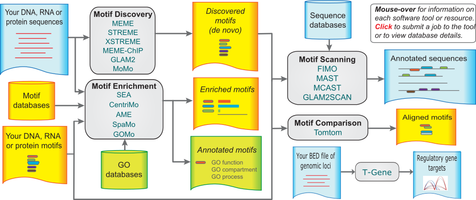
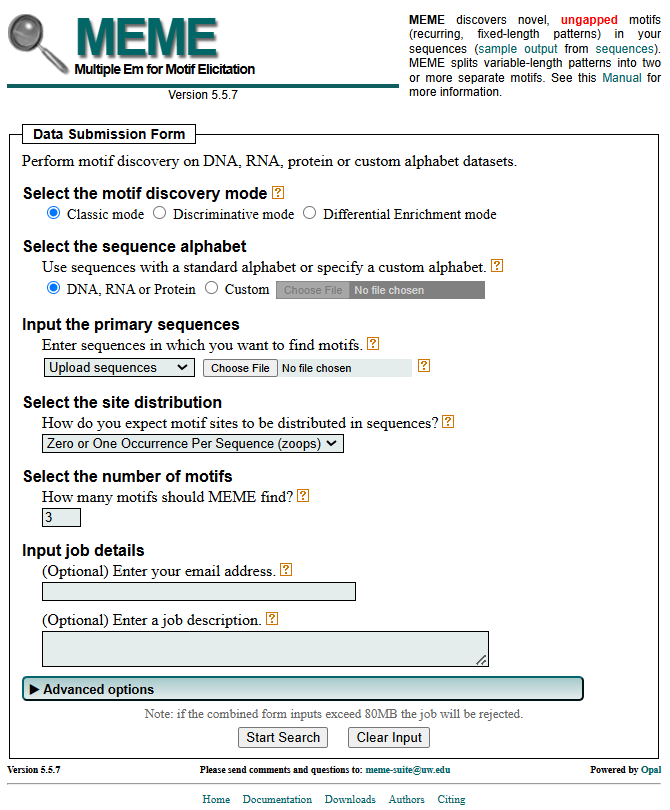

# MEME (Multiple Expectation Maximization for Motif Elicitation) 
1. [Introduction](#1)<br>
    1.1. [About MEME Suite](#11)<br>
    1.2. [Importance of Motif-based Analysis](#12)<br>
2. [Overview of MEME Parameters](#2)<br>
    2.1. [Motif Discovery Modes](#21)<br>
3. [Algorithm](#3)
4. [Application](#4)<br>
    4.1. [Motif Discovery Mode Applications](#41)<br>
5. [Limitations](#5)

## 1. Introduction<a name="1"></a>

#### 1.1. About MEME Suite<a name="11"></a>
MEME Suite is an extensive collection of motif-based sequence analysis tools, widely used in the scientific community for identifying and analyzing motifs found in biological sciences. The basis of algorithms behind the MEME Suite tools were first published in 1994 by Timothy L. Bailey and Charles Elkan from UC San Diego's Computer Science and Engineering department [1]. Its tools are specialized for motif discoveries, enrichments, scannings, comparisons, and more. This chapter will be focused on MEME, which is a motif discovery tool within MEME Suite.



#### 1.2. Importance of Motif-based Analysis<a name="12"></a>
Motifs are short repetitive patterns in DNA, RNA, and protein sequences that are biologically significant. They play a vital role in understanding biological processes because they often correspond to functional or regulatory elements within the genome. Some instances include transcription factor binding sites, splice junctions, and protein-protein interaction sites[2].

There are two types of motifs: Ungapped motifs and gapped motifs. Both are recurring sequences, with a key difference in that ungapped motifs are fixed-length and gapped motifs are variable-length.

Ungapped motifs mostly look into conserved sequence patterns. For example, the TATA box is considered an ungapped motif because it is a contiguous and uninterrupted promoter sequence that serves as a transcription binding site.


In contrast, gapped motifs contain slight nucleotide changes that are important to consider when examining their impacts on biological function. An example of this is the following bacterial σ70 promoter: TTGACA– (16-19 bp gap) –TATAAT[3]. Despite this gap, the promoter is still able to maintain its role in RNA polymerase binding and transcription initiation within e. coli. More about this motif can be found in this paper.

## 2. Overview of MEME Parameters<a name="2"></a>
The MEME tool’s basic function is to discover ungapped motifs in inputted group(s) of unaligned sequences through one of three motif discovery modes: Classic, Discriminative, and Differential. It also requires the selection of specific parameters to improve the quality of the motif search, which site distribution assists in doing by informing MEME of expected motif distribution. In general, the tool will have the following usage formats:
- Input: Group of related sequences (DNA, RNA, or protein) in FASTA/BED format
- Output: As many discoverable motifs as requested, to be graphed in the resulting pictogram

Below is the website application for the MEME tool:


There is also a command-line version, which installable programs can be found here.

#### 2.1. Motif Discovery Modes<a name="21"></a>
There are three types of motif discovery modes to choose from depending on the context of the problem [4]:
| Motif Discovery Mode | Description | Basic Usage |
|----------------|----------------|----------------|
| Classic Mode | In this mode, MEME measures enrichment relative to a (higher order) random model based on freqeuncies of the letters in the provided sequences. It could also be relative to frequencies based on a custom background model, which can be provided through the advanced options. | <ul><li>Input: One set of sequences<li><u1>Output: Motifs enriched in this set |
| Discriminative Mode | This mode searches for motifs that appear more in the target set than the control set. Position-specific priors (PSPs) are generated for the target set, which are used to focus MEME on patterns in the target set that do not appear in the control set. | <ul><li>Input: Two sets of sequences, a primary (target) set and secondary (control) set<li><u1>Output: Motifs enriched in the primary set relative to the control set |
| Differential Enrichment Mode | Similar to Discriminative Mode, this mode also counts how often motifs appear in the target set compared to the control set. It gives a higher score to motifs that appear more frequently in comparison of the two sets. | <ul><li>Input: Two sets of sequences, a primary (target) set and secondary (control) set<li><u1>Output: Motifs enriched in the primary set relative to the control set |

Note: Discriminative Mode and Differential Mode address the same problem using two different algorithms. Discriminative Mode calculates Position-specific priors (PSPs), which assign a probability that a motif starts at each possible location in the sequence data to help guide MEME's search towards sites that have higher values, indicating frequency in the primary set as opposed to control set. Differential Mode optimizes an objective function based on the hypergeometric distribution to determine the relative enrichment of the primary set as opposed to control set.

## 3. Algorithm<a name="3"></a>
To understand the algorithm behind MEME, it is best to consider the full name, Multiple Expectation Maximization for Motif Elicitation. The name lays out the key component of using an EM algorithm to determine whether sequences are part of a motif or the background. In their paper, “Fitting a mixture model by expectation maximization to discover motifs in biopolymers,” Bailey and Elkan describe exactly as the title suggests. To give some background, a mixture model is a probabilistic model for representing subpopulations within an overall population, or motifs from a sequence in our case. Each sequence can contain zero, one, or multiple motif occurrences. The model has two components: A motif component and a background component. The background component represents all regions that are not part of the motif while the motif component naturally represents the subpopulation being examined. The algorithm estimates the model parameters (mixing probabilities, motif frequencies, background frequencies) to maximize the likelihood of the data, specifically using log likelihood in calculations. This is done using the E-Step in EM, the expected probability that a subsequence belongs to the motif or background is found. Then, in the M-Step, the model parameters are updated based on these probabilities. These steps are iteratively done until no significant new motifs are found. A motif is discovered by fitting the mixture model to the data. The identified motif is then "erased" probabilistically (reducing its contribution) so the algorithm can find additional motifs. By discovering new motifs in a given dataset, the algorithm can be designated under unsupervised learning as it is not necessary to pre-align sequences or have prior knowledge of motifs within the sequences. The exact formulas can be found within the referenced 1994 [paper]([https://www.nature.com/articles/nature24281]) by Bailey and Elkan.

## 4. Application<a name="4"></a>
Here is an example of MEME tool usage with a FASTA input file:
```
>ce1cg 17 61
TAATGTTTGTGCTGGTTTTTGTGGCATCGGGCGAGAATAGCGCGTGGTGTGAAAGACTGTTTTTTTGATCGTTTTCACAA
AAATGGAAGTCCACAGTCTTGACAG
>ara 17 55
GACAAAAACGCGTAACAAAAGTGTCTATAATCACGGCAGAAAAGTCCACATTGATTATTTGCACGGCGTCACACTTTGCT
ATGCCATAGCATTTTTATCCATAAG
>bglr1 76
ACAAATCCCAATAACTTAATTATTGGGATTTGTTATATATAACTTTATAAATTCCTAAAATTACACAAAGTTAATAACTG
TGAGCATGGTCATATTTTTATCAAT
>crp 63
CACAAAGCGAAAGCTATGCTAAAACAGTCAGGATGCTACAGTAATACATTGATGTACTGCATGTATGCAAAGGACGTCAC
ATTACCGTGCAGTACAGTTGATAGC
>cya 50
ACGGTGCTACACTTGTATGTAGCGCATCTTTCTTTACGGTCAATCAGCAAGGTGTTAAATTGATCACGTTTTAGACCATT
TTTTCGTCGTGAAACTAAAAAAACC
>deop2 7 60
AGTGAATTATTTGAACCAGATCGCATTACAGTGATGCAAACTTGTAAGTAGATTTCCTTAATTGTGATGTGTATCGAAGT
GTGTTGCGGAGTAGATGTTAGAATA
>gale 42
GCGCATAAAAAACGGCTAAATTCTTGTGTAAACGATTCCACTAATTTATTCCATGTCACACTTTTCGCATCTTTGTTATG
CTATGGTTATTTCATACCATAAGCC
>ilv 39
GCTCCGGCGGGGTTTTTTGTTATCTGCAATTCAGTACAAAACGTGATCAACCCCTCAATTTTCCCTTTGCTGAAAAATTT
TCCATTGTCTCCCCTGTAAAGCTGT
>lac 9 80
AACGCAATTAATGTGAGTTAGCTCACTCATTAGGCACCCCAGGCTTTACACTTTATGCTTCCGGCTCGTATGTTGTGTGG
AATTGTGAGCGGATAACAATTTCAC
>male 14
ACATTACCGCCAATTCTGTAACAGAGATCACACAAAGCGACGGTGGGGCGTAGGGGCAAGGAGGATGGAAAGAGGTTGCC
GTATAAAGAAACTAGAGTCCGTTTA
>malk 29 61
GGAGGAGGCGGGAGGATGAGAACACGGCTTCTGTGAACTAAACCGAGGTCATGTAAGGAATTTCGTGATGTTGCTTGCAA
AAATCGTGGCGATTTTATGTGCGCA
>malt 41
GATCAGCGTCGTTTTAGGTGAGTTGTTAATAAAGATTTGGAATTGTGACACAGTGCAAATTCAGACACATAAAAAAACGT
CATCGCTTGCATTAGAAAGGTTTCT
>ompa 48
GCTGACAAAAAAGATTAAACATACCTTATACAAGACTTTTTTTTCATATGCCTGACGGAGTTCACACTTGTAAGTTTTCA
ACTACGTTGTAGACTTTACATCGCC
>tnaa 71 
TTTTTTAAACATTAAAATTCTTACGTAATTTATAATCTTTAAAAAAAGCATTTAATATTGCTCCCCGAACGATTGTGATT
CGATTCACATTTAAACAATTTCAGA
>uxu1 17
CCCATGAGAGTGAAATTGTTGTGATGTGGTTAACCCAATTAGAATTCGGGATTGACATGTCTTACCAAAAGGTAGAACTT
ATACGCCATCTCATCCGATGCAAGC
>pbr322 53
CTGGCTTAACTATGCGGCATCAGAGCAGATTGTACTGAGAGTGCACCATATGCGGTGTGAAATACCGCACAGATGCGTAA
GGAGAAAATACCGCATCAGGCGCTC
>trn9cat 1 84
CTGTGACGGAAGATCACTTCGCAGAATAAATAAATCCTGGTGTCCCTGTTGATACCGGGAAGCCCTGGGCCAACTTTTGG
CGAAAATGAGACGTTGATCGGCACG
>tdc 78
GATTTTTATACTTTAACTTGTTGATATTTAAAGGTATTTAATTGTAATAACGATACTCTGGAAAGTATTGAAAGTTAATT
TGTGAGTGGTCGCACATATCCTGTT
```

The following is the output of 3 motifs, as requested:

Taking a closer look at the first motif, the x-axis describes the position of the MEME in relation to each other, and the y-axis represents the frequency of a base appearing at that position. In this example, positions 3-5 would have 100% CTG base occurrence, whereas position 11 has all 4 types of bases, with A most predominantly.

#### 4.1. Motif Discovery Mode Applications<a name="41"></a>
MEME can be utilized through any of the three modes mentioned previously. A couple of possible application instances include using Classic Mode to search for transcription factor binding site motifs in a set of DNA sequences, and Differential or Discriminative Mode could be used interchangeably to compare protein expression levels between healthy and diseased cells.

## 5. Limitations<a name="5"></a>

One important limitation to note is that MEME can only handle ungapped motifs (fixed-length patterns). Therefore, variable-length patterns must be split into multiple separate “ungapped” motifs. For datasets with gapped motifs, it is recommended to use GLAM2 instead of MEME from MEME Suite, which is specialized for such calculations. 

Another limitation is that MEME works best on smaller sets of sequences. For datasets with greater than 50+ sequences, it is better to use STREME from MEME Suite. MEME can handle at most 500,000 (primary) FASTA sequences, and 80,000,000 bytes of data. Ideally, use MEME with sequences 100-500 bp in length.

# References
