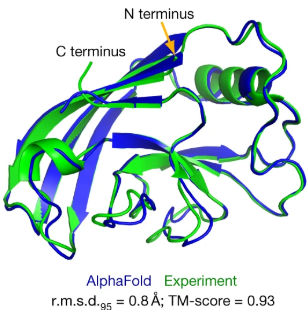
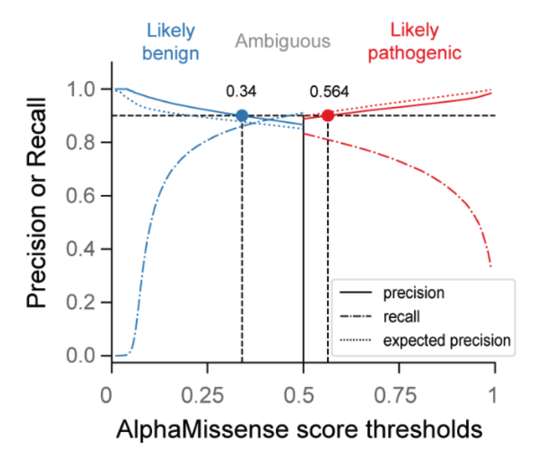
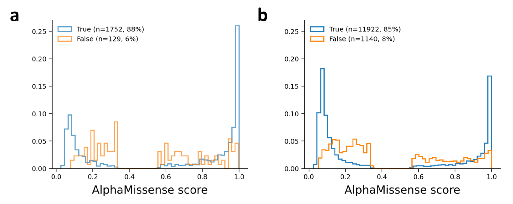
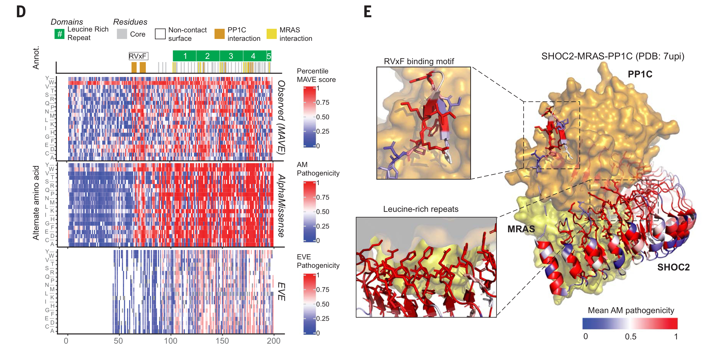
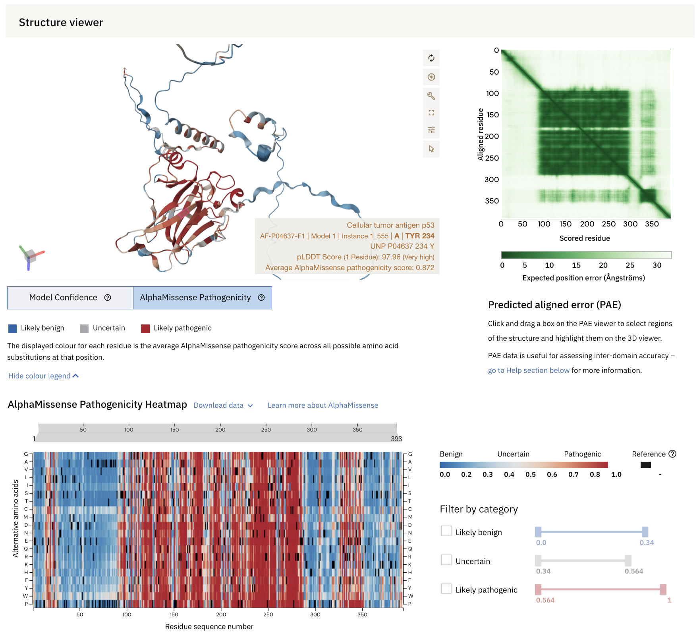
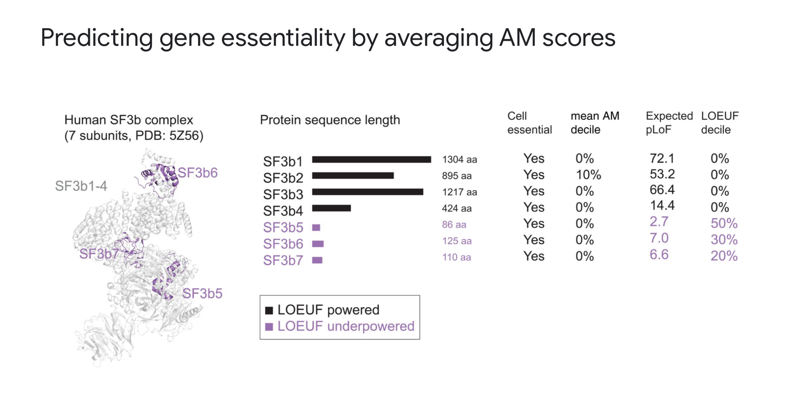

# AlphaMissense

## Contents

## Introduction and Background

To understand AlphaMissense, it is first important to introduce AlphaFold. AlphaFold was a groundbreaking AI system developed by Google DeepMind that is used to predict protein structure. AlphaFold improved upon previous models for predicting the 3D structure of proteins. Shown below is one example of a protein structure elucidated in the original AlphaFold paper. The TM-score is a metric used to compare protein structures, and 1 indicates a perfect match. In this example, the TM-score of 0.93 indicates that the protein model produced by AlphaFold is highly accurate.

AlphaMissense is essentially an extension of AlphaFold, and builds upon the models and protein data already provided by AlphaFold. The biological problem that researchers wanted to address was the difficulty in properly identifying missense mutations that have a pathogenic impact. There have been over 4 million missense mutations observed in the human genome. However, only around 2% are pathogenic, while the other 98% are benign. This discrepancy results in data that has a large amount of background noise in identifying and studying the crucial mutations. Previously, multiplexed assays of variant effect (MAVEs) were the main way that pathogenicity was assessed, and although they are effective, they are expensive in cost, time, and labor. By leveraging AlphaFold’s deep learning capabilities and large-scale protein structure data, AlphaMissense aims to predict how specific mutations that affect individual amino acids might alter protein folding, stability, and ultimately function that form the molecular basis of diseases.

## Overview of Model

At a high-level, AlphaMissense takes a missense variant as input and as its output, predicts its pathogenicity as being either “likely pathogenic”, “likely benign”, or “uncertain/ambiguous”. The pathogenicity score that users will interpret will be from a scale of 0 to 1, where 0.34 or lower corresponds to “likely benign”, 0.564 or higher to “likely pathogenic”, and in between is ambiguous. These cutoffs were determined in order for the model to achieve 90% precision.

AlphaMissense’s model is first pre-trained as AlphaFold2 to infer the sequence to structure relationship in proteins, as the context of a missense variant within its amino acid sequence and 3D structure can provide insight into its potential pathogenicity.

Additionally, in this stage, AlphaMissense contains a component where it is tasked with understanding the statistics of protein evolutionary history by using unsupervised protein language modeling to learn amino acid distributions, where it is conditioned also on the context of a protein’s structure (previously predicted by AlphaFold2). This is done by querying multiple sequence alignment (MSA) databases, where each row is a different species and each column is a position in an amino acid sequence. However, some of these sequence positions are masked from the model, and the model is then challenged to predict what these amino acids should be in the hidden positions– hence, learning patterns across species and positions to determine these identities.

Once the pre-training stage has been completed, AlphaMissense enters a fine-tuning stage where it undergoes weak supervision on human sequence variation. “Benign” labels are assigned to variants frequently observed in human and primate populations, while “Pathogenic” labels are assigned to variants absent from these populations. The model is then challenged for each position on a protein that is masked, to determine whether a particular variant at that position will be present or absent in the human population. A benefit to the approach taken in the fine-tuning stage is that AlphaMissense avoids introducing biases from human-curated annotations for variants in the population, and rather focuses on the actual observed variant frequencies.

Finally, a diverse amount of datasets were used to evaluate AlphaMissense’s predictions, such as the ClinVar annotated missense variants database (https://pubmed.ncbi.nlm.nih.gov/29165669/), a de novo mutations database (https://www.nature.com/articles/nature21062), as well as experimental MAVE data in the ProteinGym benchmark set (https://www.biorxiv.org/content/10.1101/2023.12.07.570727v1).

To summarize the big picture, three important inductive biases inform AlphaMissense’s model:
Structural context
Protein evolutionary history
Observed sequence variation

## Performance

Ultimately, AlphaMissense’s performance and capabilities are impressive. At an auROC of 0.940, approximately 18,924 ClinVar test variants were classified, which is a leap forward from an auROC of 0.911 by the second leading tool which was also not trained on ClinVar test variants, the Evolutionary model of Variant Effect (EVE). 71 total million missense variant predictions were made across 19,233 human proteins, out of all 216 million possible single amino acid changes. 32% of these variants were found likely to be pathogenic, and 57% likely benign. Performance is also consistent across different AlphaFold pLDDT confidence scores.

Furthermore, when assessing the performance of AlphaMissense with a prioritized set of clinically actionable genes by the American College of Medical Genetics (ACMG), 26 genes out of these 34 (77%) showed improvements in their predictions of pathogenicity over EVE. In another set of proteins prioritized for future MAVE studies based on their clinical relevance, AlphaMissense again outperforms EVE in its predictions for 16 of the genes (80%).

However, it is important to note that AlphaMissense’s accuracy in predictions can vary depending on different structural groups whose residues may appear in more disordered regions. For instance, in an analysis of AlphaMissense data separated into non-transmembrane (non-TM) and transmembrane (TM) regions for TM proteins, Tordai et al. demonstrated that AlphaMissense’s performance varies across TM and non-TM regions (2024). The graphs below show this distribution of predictions in TM (a) and soluble (b) regions of the proteins, with 88% correct predictions for TM regions made compared to 85% for soluble regions. Furthermore, in investigating the model’s performance for membrane-interacting residues, a low Matthews correlation coefficient (MCC) of 0.496 was seen. Likely, this is due to the low sequence conservation and greater intrinsic disorder found in lipid-interacting disordered regions of the membrane molecular recognition features dataset (MemMoRF).

## Example with SHOC2-MRAS-PP1C Complex

The above figure shows an example of AlphaMissense used to assess the pathogenicity of specific domains in the SHOC2 oncoprotein. SHOC2 binds with MRAS and PP1C to form a complex which activates the Ras-MAPK signaling pathway. On the left (D) are three heatmaps: the top representing MAVE data, the middle for AlphaMissense, and the bottom for EVE. Each of these heatmaps highlight the average pathogenicity at each amino acid position across all possible substitutions for the first 200 amino acids of SHOC2 (the pathogenicity in the MAVE assay was measured through cell growth in SHOC2-dependent cancer cells). As can be seen, there are very similar residue-level patterns observed between the MAVE and SHOC2 data (positional Spearman correlation of 0.64), whereas EVE, ESM1b, and ESM1v have lower agreement with MAVE (positional Spearman correlations of 0.48, 0.56, and 0.55 respectively).

Additionally, in figure E, we can see a zoom-in into the RVxF binding motif of SHO2, which is a functionally important region for the protein to bind to PP1C. This region (residues 63 to 74) was found to be pathogenic according to the MAVE assay, and out of the formerly mentioned models, AlphaMissense was the only one to correctly predict it as pathogenic. Furthermore, the leucine-rich repeat domains of SHOC2 starting at position 80 and repeating every 23 residues are very important for contact with MRAS and PP1C. We can visualize in the heatmaps this clear pattern and agreement in average pathogenicity scores between the MAVE data and AlphaMissense, with the latter achieving a median score of around 0.96-0.98. EVE does not display this pattern as strongly, and in fact misses part of the pattern-level predictions from before position 100.

## Data Integration

Excitingly, AlphaMissense has been widely integrated into a variety of EMBL-EBI’s open data resources and tools, increasing the accessibility of its data for researchers’ uses. A couple of these resources include:

(FIX LIST FORMATTING) \
Ensembl Variant Effect Predictor Tool (https://www.ensembl.org/info/docs/tools/vep/index.html), where AlphaMissense pathogenicity scores have been included in annotations of all variants. This data can be accessed via Ensembl’s web interface, REST API, or command line interface.
DECIPHER (https://www.deciphergenomics.org/). AlphaMissense scores and pathogenicity classifications are displayed along the variant annotation pages.
UniProt (https://www.uniprot.org/). You can view the AlphaMissense variation scores alongside a protein’s AlphaFold-predicted 3D structure in the ProtVista protein sequence viewer.
ProtVar (https://www.ebi.ac.uk/ProtVar/). This tool provides a glimpse at the residue level of functional annotations derived from UniProt, including predicted structural features in a protein that may impact how variants are interpreted, along with the inclusion of AlphaMissense scores.
AlphaFold Database (https://alphafold.ebi.ac.uk/). Next to the Model Confidence tab, there is now an “AlphaMissense Pathogenicity” tab and interactive heatmap allowing you to examine missense variants at the residue level while also taking into consideration 3D aspects of the protein‘s structure.

## Applications and Real-Life Examples

(FIX LIST FORMATTING)

Missense mutations are known to cause potential diseases such as cystic fibrosis, sickle-cell anemia, and cancer. A combination of multiple genetic variations can cause more complex diseases such as Type 2 diabetes. AI tools such as Alpha Missense use laboratory experiment results enabling the predictions of how variants impact protein function, aiding in identifying pathogenic missense mutations and previously undiscovered disease-causing genes. 

Population Genomics
Provides pathogenicity predictions, allowing researchers to understand genetic variation in a large data set.
Identify variants in *selective pressure
Understand patterns in the population – frequency of disease, adaptive genetic changes

Potential Drug Targets 
Identifying drug targets
Helps to find proteins critical to disease pathways helping to find the drug targets 
Effect of missense mutation on the protein structure
Design personalized treatments – understanding of genotype-phenotype relationship

Evolutionary Studies

Calculates average prediction(AM scores) for each gene, which is similar to measuring a gene’s evolutionary constraint—how essential the gene is for the organism’s survival. 
Identify positive/negative selection
Understand the roles of adaptation
An example of an SF3b complex used to see how each length contributes to the essentiality:

## Limitations

(FIX FORMAT)
* Selective Pressure: Evolutionary force that influences reproductive success. 
Limitations
Description
Length Restriction
Long sequences can result in a loss of contextual information:due to the limitation of the method
Memory limitation
Short genes can be underpowered 
Lack of Context from DNA/RNA
Splicing/regulatory information may be missed
Simultaneous mutations may not be captured
Lack of detailed structural change information - biophysical properties, like, stability and binding affinity
De Novo Proteins
Lack of *homologous sequence
Reduces the ability to find protein-coding regions because no existing datasets can be found
No consideration of complex genetic variations
Limited to single amino acid substitution
*Epistasis not considered
*Structural Variants not considered
Mutations in proteins that form complexes can cause disease in ways that will not be obvious when considering only monomeric structures.
Doesn’t account for potential interactions with other proteins 
Scoring from 0 to 1
No information on penetrance, haploinsufficiency and specific disease

* Homologous Sequence: sequences that provide strong evidence of shared ancestry between organisms 
*Epistasis: Interaction between variants
*Structural Variants: Insertion, Deletion, Duplication 

## References

(FIX FORMAT)
Cheng, J., Novati, G., Pan, J., Bycroft, C., Žemgulytė, A., Applebaum, T., Pritzel, A., Wong, L. H., Zielinski, M., Sargeant, T., Schneider, R. G., Senior, A. W., Jumper, J., Hassabis, D., Kohli, P., & Avsec, Ž. (2023). Accurate proteome-wide missense variant effect prediction with AlphaMissense. Science (New York, N.Y.), 381(6664), eadg7492. https://doi.org/10.1126/science.adg7492
Minton, K. Predicting variant pathogenicity with AlphaMissense (2023). Nat Rev Genet 24, 804. https://doi.org/10.1038/s41576-023-00668-9
Yi M, Liu Y, Su Z (2024). AlphaMissense, a groundbreaking advancement in artificial intelligence for predicting the effects of missense variants. MedComm – Future Medicine, 3:e70. doi:10.1002/mef2.70
Inside Precision Medicine (2023, September 19). AlphaMissense Classifies Mutation Pathogenicity. https://www.insideprecisionmedicine.com/topics/precision-medicine/alphamissense-classifies-mutation-pathogenicity/
Tordai, H., Torres, O., Csepi, M. et al. (2024). Analysis of AlphaMissense data in different protein groups and structural context. Sci Data 11, 495. https://doi.org/10.1038/s41597-024-03327-8
AlphaMissense Predictions for Human Genetic Variation Research (2024, June 7). YouTube. https://www.youtube.com/watch?v=49E9m3XcgjU
Wang Y, Masson E, Liao Z, et al. (2024). Strengths and limitations of AlphaMissense in CPA1 missense variant classification. Gut; 73:e42. https://doi.org/10.1136/gutjnl-2024-332120