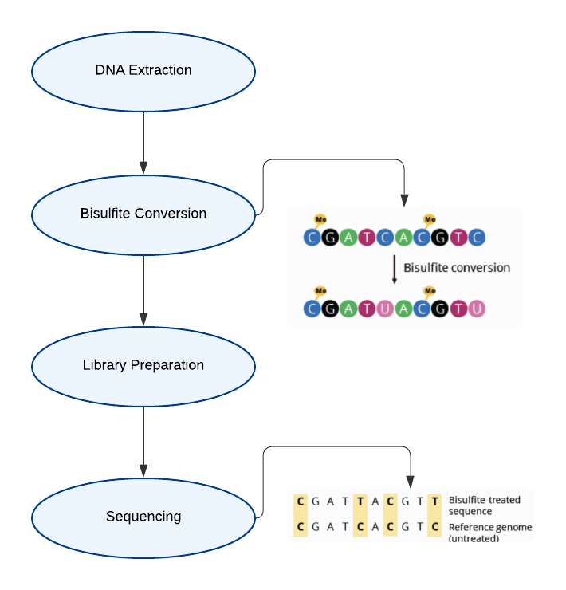
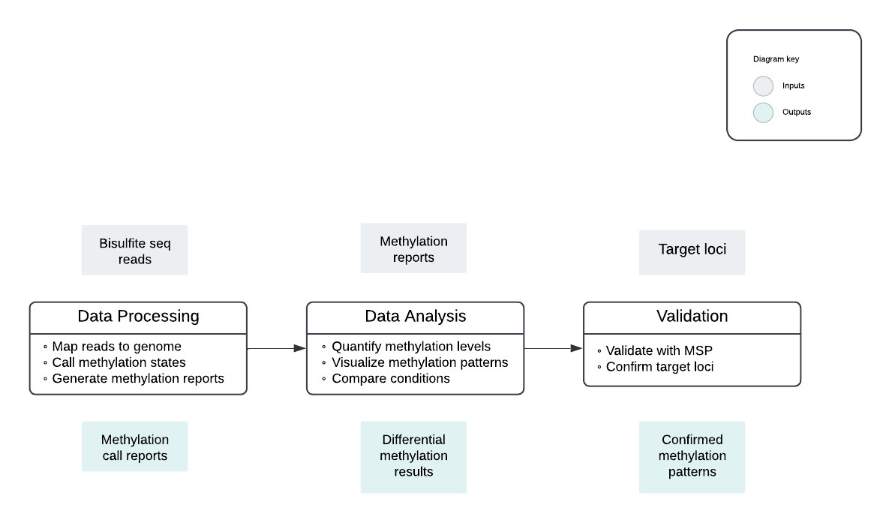

# **Understanding Bisulfite Sequencing: A Comprehensive Guide**

## **1. Introduction**

DNA methylation is a vital epigenetic modification critical in regulating gene expression, maintaining genome stability, and orchestrating developmental processes. Adding a methyl group to cytosine residues can silence genes, modulate chromatin structure, and mark genomic regions for imprinting. Aberrant DNA methylation has been implicated in numerous diseases, including cancer, neurodegenerative disorders, and autoimmune diseases.

Among the available methods to study DNA methylation, **bisulfite sequencing** is the gold-standard technique. It provides single-base resolution maps of methylated cytosines, offering unparalleled insights into the epigenome. Bisulfite sequencing enables researchers to detect subtle changes in methylation patterns across genomes and link these modifications to biological and pathological processes.

In this chapter, we explore the principles, experimental workflow, bioinformatic analysis, applications, limitations, and future directions of bisulfite sequencing, providing a holistic view of its impact on epigenetics.

---

## **2. Principles of Bisulfite Sequencing**

### **2.1 DNA Methylation**

DNA methylation typically involves adding a methyl group to the 5th carbon of cytosine bases, mediated by DNA methyltransferases (DNMTs). This modification primarily occurs in CpG dinucleotides, though non-CpG methylation is also observed in specific cell types, such as embryonic stem cells.

Methylation is critical for processes like:

- **Gene silencing**: Methylation at promoters can repress transcription by preventing transcription factor binding or recruiting repressive complexes.
- **Chromatin structure**: Methylation interacts with histone modifications to compact chromatin and regulate access to DNA.
- **Imprinting**: Parental-specific methylation patterns govern gene expression in embryonic development.
- **X-chromosome inactivation**: In females, methylation helps silence one X chromosome to achieve dosage compensation.

### **2.2 Chemistry of Bisulfite Conversion**


As shown in *figure 1*, the core principle of bisulfite sequencing lies in the selective chemical conversion of cytosine to uracil, while methylated cytosine remains unaltered. Bisulfite reacts with cytosine to produce a sulfonated intermediate, which deaminates to uracil under alkaline conditions. Methylated cytosines are resistant to this reaction, preserving their identity.

After PCR amplification, uracils are replaced with thymines, allowing differentiation between methylated (unaltered) and unmethylated (converted) cytosines.

**Key Reaction Steps**:

1. **Sulfonation**: Cytosine reacts with bisulfite to form cytosine sulfonate.
2. **Deamination**: Cytosine sulfonate is converted to uracil sulfonate.
3. **Desulfonation**: Uracil sulfonate is converted to uracil under alkaline conditions.

This simple yet powerful chemistry forms the foundation of bisulfite sequencing.

---

## **3. Experimental Workflow**



### **3.1 DNA Extraction**

High-quality DNA is essential for successful bisulfite sequencing. The process begins with isolating genomic DNA from tissues or cells using standard extraction methods. Ensuring the integrity of the DNA is critical, as bisulfite treatment can degrade DNA and reduce sequencing efficiency.

### **3.2 Bisulfite Treatment**

Bisulfite treatment is the cornerstone of bisulfite sequencing, enabling single-base resolution analysis of DNA methylation by chemically converting unmethylated cytosines to uracils. This process involves several steps under carefully controlled conditions to ensure specificity and minimize DNA damage.

#### *The Chemistry Behind Bisulfite Conversion*

Bisulfite treatment exploits the reactivity of cytosine under acidic conditions. The process can be broken down into three major steps:

1. **Sulfonation**:
    - Sodium bisulfite reacts with cytosine to form cytosine sulfonate.
    - Methylated cytosines do not undergo this reaction due to steric hindrance from the methyl group.
2. **Deamination**:
    - The sulfonated cytosine is deaminated to uracil sulfonate under acidic conditions.
3. **Desulfonation**:
    - Alkaline treatment removes the sulfonate group, yielding uracil, while methylated cytosines remain unchanged.

In subsequent sequencing, these chemical transformations are critical for distinguishing between methylated and unmethylated cytosines.

#### *Steps in Bisulfite Treatment*


1. **Denaturation**:
    
    - DNA is denatured to make single-stranded templates, as bisulfite treatment only targets single-stranded DNA.
    - Common agents: Sodium hydroxide or heat.
2. **Bisulfite Conversion**:
    
    Sodium bisulfite is applied to DNA at low pH and high temperature to catalyze the sulfonation and deamination steps.
    - Typical reaction conditions:
        - pH 5.0–6.0
        - Temperature: 50–70°C
        - Duration: 4–16 hours, depending on protocol.
3. **Desulfonation**:
    - DNA is treated with an alkaline solution to remove the sulfonate group and stabilize the uracil.
    
1. **Purification**:
    - Bisulfite-treated DNA is purified to remove reaction by-products and prevent downstream interference. Silica-column-based purification or magnetic beads are common methods.

#### *Challenges in Bisulfite Treatment*

1. **DNA Degradation**:
    
    - **Cause**: The acidic and high-temperature conditions used during bisulfite treatment fragment DNA, reducing its integrity.
    - **Impact**: Shorter DNA fragments can result in uneven sequencing coverage, particularly in GC-rich regions.
    - **Mitigation Strategies**:
        - Use of additives like tetramethylammonium chloride (TMAC) to stabilize GC-rich regions.
        - Optimized reaction times to minimize overexposure to harsh conditions.
2. **Incomplete Conversion**:
    
    - **Cause**: Suboptimal reaction conditions may leave some unmethylated cytosines unconverted, leading to false-positive methylation calls.
    - **Mitigation Strategies**:
        - Use freshly prepared bisulfite reagents to maintain reactivity.
        - Extend reaction times, but balance against DNA degradation.
        - Commercial kits optimize this step for consistency.
3. **Loss of DNA**:
    
    - Bisulfite treatment inherently reduces the yield of usable DNA.
    - **Solution**: Start with high concentrations of input DNA (commonly >500 ng for genomic DNA).

#### *Key Considerations for Bisulfite Treatment*

1. **Input DNA Quality**:
    
    - Start with high-quality, high-molecular-weight DNA to maximize the success of bisulfite conversion and library preparation.
2. **Control Reactions**:
    
    - Include both methylated and unmethylated control DNA to validate conversion efficiency.
3. **Reaction Optimization**:
    
    - Test different reaction times and temperatures using custom protocols to balance conversion efficiency and DNA integrity.
4. **Post-Treatment Verification**:
    
    - Confirm the success of bisulfite conversion using PCR or sequencing before proceeding to library preparation.

### **3.3 Library Preparation**

Following bisulfite treatment, DNA is fragmented and ligated to sequencing adapters. PCR amplification enriches the bisulfite-converted fragments for sequencing. The library preparation step is crucial to ensure sufficient genome coverage and avoid PCR bias, which can lead to uneven representation of methylation sites.

### **3.4 Sequencing**

Prepared libraries are sequenced using next-generation sequencing (NGS) platforms like Illumina. Short-read technologies provide high throughput and resolution but may struggle with repetitive regions. Long-read technologies like Oxford Nanopore are emerging as alternatives directly detecting methylation without bisulfite treatment.

---
## **4. Bioinformatic Analysis**

Analyzing bisulfite sequencing data requires specialized bioinformatics tools that can handle the unique challenges of bisulfite-induced cytosine-to-thymine conversions. This section outlines a standard workflow using  widely adopted tools in the field.

### **4.1 Quality Control**

The first step in the workflow involves assessing the quality of raw sequencing reads to ensure they are suitable for downstream processing.

####  *FastQC*

- **Purpose**: Evaluate key metrics such as per-base quality scores, GC content, adapter contamination, and sequence duplication levels.
- **Usage**:
  ```bash
    fastqc sample_R1.fastq sample_R2.fastq -o output_folder
    ```
- **Common Workflow**:
    - Use **FastQC** to inspect raw reads.
    - Use **Trim Galore!**, a wrapper for Cutadapt, to remove low-quality bases and adapter sequences.
        ```bash
        trim_galore --paired sample_R1.fastq sample_R2.fastq -o output_folder
        ```
### **4.2 Read Alignment**



Mapping bisulfite-converted reads to a reference genome is a critical step. The unique C-to-T conversions introduced during bisulfite treatment require specialized aligners.

#### *Bismark*
- **Purpose**: Maps bisulfite-treated reads to a bisulfite-converted reference genome, accounting for C-to-T (and G-to-A on the reverse strand) mismatches.
- **Workflow**:
    1. **Genome Preparation**: Convert the reference genome into bisulfite-converted strands:
        ```bash
        bismark_genome_preparation --bowtie2 /path/to/genome
        ```
    2. **Alignment**: Map paired-end reads:
        ```bash
        bismark --genome /path/to/genome -1 sample_R1.fastq -2 sample_R2.fastq -o results/
        ```
    3. **Output**: Bismark generates a BAM file containing aligned reads and methylation information.
### **4.3 Methylation Calling**

Once reads are aligned, cytosine methylation levels (CpG and non-CpG contexts) must be quantified. Methylation calling calculates the proportion of methylated cytosines at each site across the genome.

#### *Bismark Methylation Extractor*

- **Purpose**: Extracts methylation information from aligned reads and outputs detailed reports for downstream analysis.
- **Workflow**:
    ```bash
    bismark_methylation_extractor --comprehensive --bedGraph --gzip aligned_reads.bam
    ```    
    - The `--comprehensive` flag generates methylation calls for CpG, CHG, and CHH contexts.
    - The `--bedGraph` flag produces a BedGraph file for genome browser visualization.
- **Output**:
    - **CX Report**: Summarizes methylation levels at each site.
    - **BedGraph File**: Methylation percentages for visualization.
##### *Alternative Tools*:

- **MethylKit**:
    - R-based package for statistical analysis of methylation data.
    - Useful for differential methylation analysis across conditions.
    - Example Workflow:
	```R
	library(methylKit)
	myObj <- processBismarkAln(location="aligned_reads.bam")
	diffMeth <- calculateDiffMeth(myObj, covariates=NULL)
	```

### **4.4 Data Visualization**

Visualization helps interpret methylation data by identifying trends and patterns across genomic regions or conditions.

#### *Integrative Genomics Viewer (IGV)*

- **Purpose**: A versatile genome browser for exploring methylation data alongside gene annotations, SNPs, and other datasets.
- **Workflow**:
    1. Convert the BedGraph output to BigWig format for compatibility with IGV:
        ```bash
        bedGraphToBigWig methylation.bedGraph genome.sizes methylation.bw
        ```
    2. Load `methylation.bw` into IGV for visualization.

#### *Additional Visualization Tools*:

1. **Heatmaps**:
    - Tool: `pheatmap` in R.
    - Example:
        ```R
        library(pheatmap)
        pheatmap(methylation_matrix)
        ```

2. **Boxplots and Violin Plots**:
    - Tool: R or Seaborn (Python) for comparing methylation distributions across samples.
    - Example (Seaborn):
        ```python
        import seaborn as sns
        sns.violinplot(data=[sample1, sample2])
        ```

### *Complete Workflow Summary*

1. **Quality Control**:
    - Use **FastQC** to evaluate raw reads and **Trim Galore!** for adapter trimming and quality filtering.
2. **Alignment**:
    - Use **Bismark** to align bisulfite-treated reads and generate methylation-ready BAM files.
3. **Methylation Calling**:
    - Extract methylation levels using **Bismark Methylation Extractor**.
    - Perform differential methylation analysis with **MethylKit**.
4. **Visualization**:
    - View methylation patterns in IGV or create heatmaps, boxplots, and Circos plots for publication-quality figures.

## **5. Applications**

### **5.1 Cancer Epigenomics**

Aberrant DNA methylation is a hallmark of cancer. Bisulfite sequencing has uncovered hypermethylated tumor suppressor genes and hypomethylated oncogenes, providing biomarkers for diagnosis and targets for therapy.

**Example**: Hypermethylation of the BRCA1 promoter is linked to breast cancer, while global hypomethylation destabilizes the genome in colorectal cancer.

### **5.2 Developmental Biology**

Methylation dynamics are critical during embryogenesis and cell differentiation. Bisulfite sequencing has revealed stage-specific methylation patterns that regulate lineage specification and pluripotency.

**Example**: Demethylation of key pluripotency genes occurs during reprogramming of somatic cells into induced pluripotent stem cells (iPSCs).

### **5.3 Environmental Epigenetics**

Environmental factors like diet, stress, and pollutants can alter DNA methylation patterns, influencing health and disease susceptibility. Bisulfite sequencing enables the study of these epigenetic changes.

**Example**: Exposure to bisphenol A (BPA) during development induces hypomethylation of imprinted genes, affecting growth and metabolism.

---

## **6. Limitations and Alternatives**

### **6.1 Limitations**

- **DNA Degradation**: Bisulfite treatment causes DNA fragmentation, limiting its application in degraded samples (e.g., forensic or ancient DNA).
- **Coverage Bias**: GC-rich regions may be underrepresented due to sequencing challenges.
- **Cost and Computational Load**: Bisulfite sequencing is resource-intensive, requiring high sequencing depth and advanced bioinformatics.

### **6.2 Alternatives**

- **MeDIP-seq**: Uses antibodies to enrich methylated DNA without chemical conversion.
- **TET-assisted Sequencing**: Detects 5-hydroxymethylcytosine (5hmC), a related epigenetic mark.
- **Nanopore Sequencing**: Directly detects methylation without bisulfite treatment, offering a promising alternative for whole-genome methylation analysis.

---

## **7. Future Directions**

The field of DNA methylation analysis continues to evolve. Emerging technologies aim to overcome the limitations of bisulfite sequencing and enhance its applications:

- **Single-Cell Epigenomics**: Mapping methylation patterns in individual cells to study cellular heterogeneity.
- **Multi-Omics Integration**: Combining methylation data with transcriptomics and proteomics for a comprehensive view of gene regulation.
- **Real-Time Sequencing**: Nanopore-based methods offer real-time methylation detection, reducing costs and processing time.

These advancements promise to expand our understanding of epigenetics and its role in health and disease.

---

## **8. Conclusion**

Bisulfite sequencing is a powerful tool for studying DNA methylation at single-base resolution. Its ability to reveal intricate patterns of epigenetic regulation has transformed our understanding of gene expression, development, and disease. Despite its limitations, continued advancements in sequencing technologies and bioinformatics will ensure its central role in epigenetic research for years to come.

